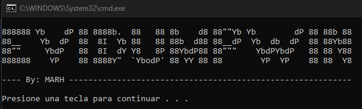
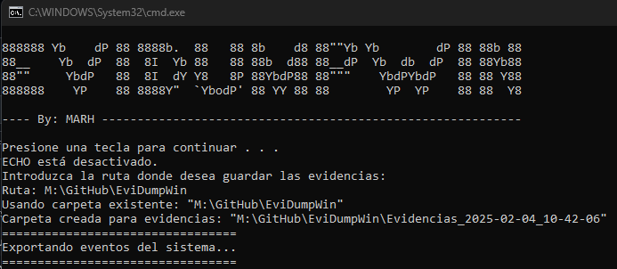
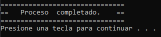

# 💾🔎 EviDump

Haciendo uso de las herramientas de SysinternalSuite de Microsoft he creado este script en bash que permite confeccionar un USB-STICK donde estén almacenadas las herramientas y el script.

El fichero BATCH se lanzará en la máquina que se pretenda peritar. Este BAT realiza funciones como copiar registros a la unidad USB externa y recopila información como fecha, hora, usuarios registrados, árbol de procesos, tiempo de actividad del sistema, etc. Todos estos registros se guardan en una carpeta y en formato.txt

# Como utilizar EviDump 

⚠️ Para utilizar este script simplemente debemos hacer click derecho y ejecutarlo con permisos de administrador.

Si pulsamos dos veces Enter comenzará el proceso 

Y una vez completado el proceso por completo veremos lo siguiente: 
 

